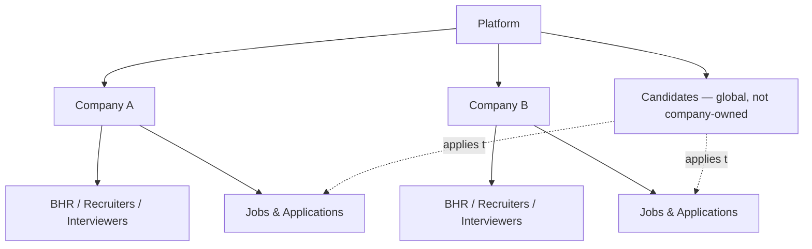
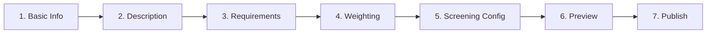
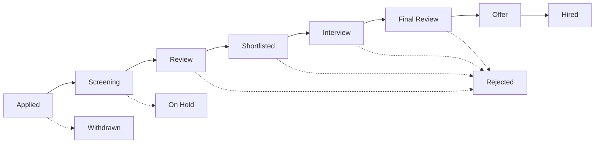
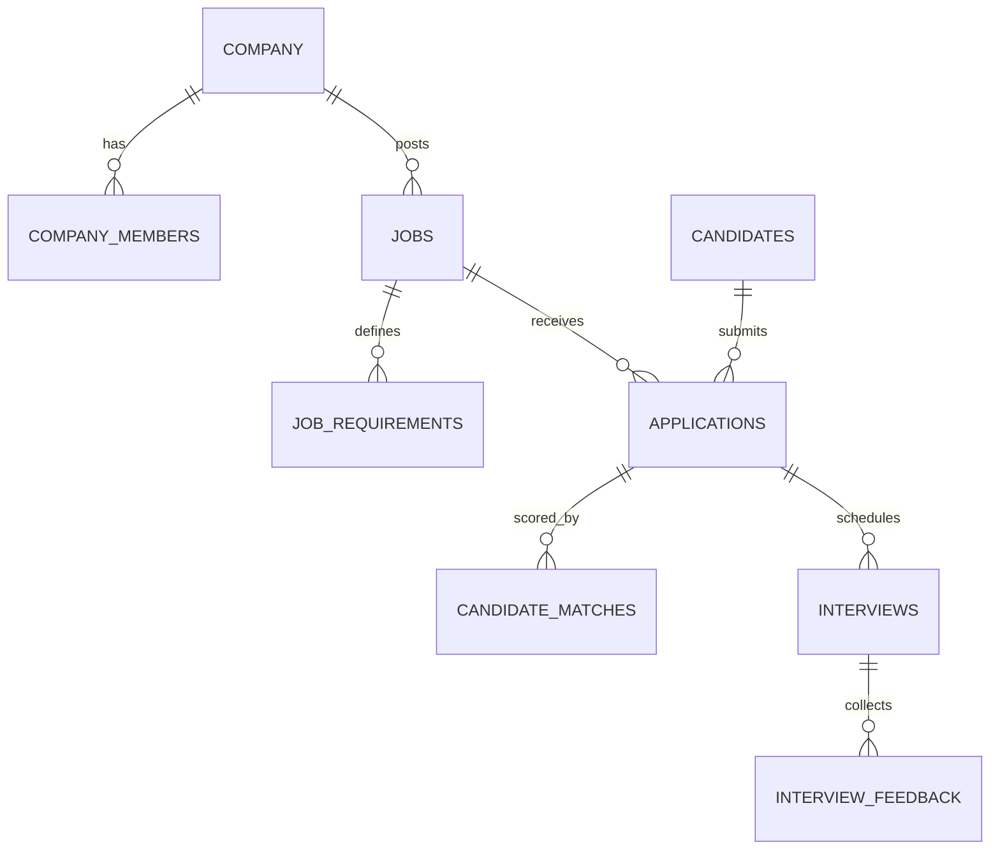

# HireFlow — Master Build Specification v2
### Multi-Tenant AI-Assisted Hiring Platform — Production-Ready Prompt Pack

---

## 0. What changed in this revision, and why the last build failed

Your original spec had the right *product* thinking, but it had three problems that make AI builders (Bolt, Lovable, Antigravity, etc.) produce broken or inconsistent output:

1. **Broken text wrapping.** The source document had hard line-breaks in the middle of sentences and words (an artifact of PDF export). When that gets pasted into a builder's prompt box, the model reads it as fragmented, oddly-emphasized text and often mis-parses requirements as separate bullet items. This version is re-flowed with clean paragraphs and no mid-word breaks.
2. **ASCII-art diagrams.** Box-drawing characters (`■`, `│`, `├──`) render inconsistently across editors and often get mangled on copy-paste, which is likely why your builder's UI came out misaligned. This version replaces them with **Mermaid diagrams** and **Markdown tables**, which every modern builder parses reliably and can even render directly.
3. **No concrete design system.** The old spec named a color palette but gave the builder no type scale, spacing scale, elevation system, or component sizing — so the AI filled in the gaps with generic "AI SaaS" defaults (the gradient-heavy, glassmorphism look you're trying to avoid). Section 5 below is a complete, numeric design system a builder can implement literally, in the style of what Bolt/Lovable produce when they're given real design tokens instead of adjectives.

Everything else below is the same product, reorganized so it can be **pasted stage-by-stage** into your AI builder without re-triggering a full regeneration each time.

---

## 1. Product Definition

**HireFlow** is a multi-tenant, AI-assisted recruitment platform. It is not a resume scanner, not a generic HR dashboard, and not a job board — it's the combination of a job marketplace, an applicant tracking system, explainable AI screening, and role-specific workspaces for every participant in a hiring loop.

```mermaid
flowchart LR
    A[Company] -->|creates| B[Job + Requirements]
    B -->|published to| C[Public Marketplace]
    C -->|discovered by| D[Candidate]
    D -->|applies with| E[Resume + Profile]
    E -->|parsed & matched by| F[AI Screening Engine]
    F -->|produces| G[Ranked, Explainable Match]
    G -->|reviewed by| H[BHR Manager / Recruiter]
    H -->|assigns| I[Interviewer]
    I -->|submits| J[Structured Feedback]
    J -->|updates| K[Application Status]
    K -->|visible to| D
```



**Core principle:** the AI recommends, a human decides. No irreversible action (rejection, hire) happens without an authenticated human confirming it.

### Non-negotiable product rules

| # | Rule |
|---|------|
| 1 | Real functionality only — no static mockups, no fake data presented as live. |
| 2 | No hard-coded names anywhere in the UI (no "Kabr", "Mohit", "John Doe" as displayed values). Every name comes from authenticated data or clearly labeled seed data. |
| 3 | UI, navigation, and data visibility change per authenticated role — never the same dashboard for everyone. |
| 4 | Companies define requirements; candidates supply qualifications; AI explains the relationship between the two. |
| 5 | AI must never silently reject or hire — every AI score ships with evidence, and a human takes the final action. |
| 6 | Authorization is enforced at the database layer (RLS), not just hidden in the UI. |
| 7 | The app must keep working (manual review still possible) if the AI provider is down. |
| 8 | No dashboard number is fabricated — if there's no data, show "Not enough data yet," never a placeholder percentage. |

---

## 2. Roles & Permissions Matrix

Five roles. Build the sidebar, dashboard, and route guard from this table directly — don't let the AI builder infer permissions from context.

| Capability | Platform Admin | BHR Manager | HR Recruiter | Interviewer | Candidate |
|---|:---:|:---:|:---:|:---:|:---:|
| Manage companies / platform users | ✅ | — | — | — | — |
| Create / publish jobs | — | ✅ | ✅ (if granted) | — | — |
| Define requirements & weights | — | ✅ | — | — | — |
| View all company applicants | — | ✅ | ✅ (assigned jobs only) | — | — |
| Run AI screening / view ranking | — | ✅ | ✅ | — | — |
| Shortlist / reject candidates | — | ✅ | ✅ (permitted stages) | — | — |
| Assign interviewers | — | ✅ | — | — | — |
| Conduct interview / submit feedback | — | — | — | ✅ (assigned only) | — |
| View company analytics | — | ✅ | ✅ (scoped) | — | — |
| Manage company team & permissions | — | ✅ | — | — | — |
| Browse jobs / apply | — | — | — | — | ✅ |
| Track own applications | — | — | — | — | ✅ |
| See other candidates' data | — | — | — | — | ❌ never |
| See internal HR notes | — | ✅ | ✅ | ❌ | ❌ never |

**Permission principle:** don't expose every BHR Manager feature to a Recruiter by default, and don't let an Interviewer ever see an unassigned interview or applicant.

---

## 3. Multi-Tenant Architecture



- A Company A user must **never** be able to query or mutate Company B's data — enforce this with Row Level Security policies keyed on `company_id`, not with frontend conditionals.
- Candidate records are global (a candidate can apply across companies) but each **application** is scoped to one company + one job.
- Test this explicitly: log in as Company A's BHR Manager and confirm Company B's jobs, candidates, and analytics are unreachable — including by direct API/URL manipulation, not just hidden nav.

---

## 4. Authentication & Authorization

- **Auth provider:** Supabase Auth — email/password, email verification, password reset, persistent sessions, secure logout. OAuth can be added later without a schema change.
- **Profile shape:**

```
profiles
├── id
├── email
├── display_name
├── avatar_url
├── role            (platform_admin | bhr_manager | hr_recruiter | interviewer | candidate)
├── company_id      (null for candidates and platform admins)
├── status
├── created_at
└── updated_at
```

- **Two layers of authorization, always both:**
  1. **UI layer** — hide/disable what a role shouldn't see.
  2. **Database layer** — Postgres RLS policies that reject the request even if it's called directly. The UI layer is a convenience, never the security boundary.

---

## 5. Design System — Modern, Bolt/Lovable-Grade

This is the section that was missing numeric precision before. Treat every value below as a literal design token the builder should implement (CSS variables / Tailwind config), not a suggestion.

### 5.1 Design direction

Bright, precise, confident SaaS — the register of Linear, Vercel, and modern Bolt/Lovable output. Depth comes from **layered elevation and typography weight**, not gradients or glass blur. Think of every surface as a physical card lit from above: a clear light source, soft consistent shadows, sharp edges at small radii, generous negative space.

### 5.2 Color tokens

```css
:root {
  /* Brand */
  --color-primary:        #2563EB;
  --color-primary-hover:  #1D4ED8;
  --color-primary-active: #1E40AF;
  --color-primary-light:  #EFF6FF;

  /* AI accent — reserved ONLY for AI-generated content/actions */
  --color-ai:        #7C3AED;
  --color-ai-light:  #F5F3FF;

  /* Surfaces */
  --color-bg:        #F8FAFC;
  --color-surface:   #FFFFFF;
  --color-surface-2: #F1F5F9;  /* nested cards / hover rows */

  /* Text */
  --color-text:        #0F172A;
  --color-text-secondary: #475569;
  --color-text-muted:  #64748B;
  --color-border:      #E2E8F0;
  --color-border-strong: #CBD5E1;

  /* Status */
  --color-success:  #16A34A;
  --color-success-bg: #F0FDF4;
  --color-warning:  #F59E0B;
  --color-warning-bg: #FFFBEB;
  --color-danger:   #DC2626;
  --color-danger-bg: #FEF2F2;

  /* Header / high-emphasis action override */
  --color-header-btn:       #000000;
  --color-header-btn-hover: #171717;
  --color-header-btn-text:  #FFFFFF;
}
```

**Color usage rule (enforced, not decorative):**

| Color | Use for | Never use for |
|---|---|---|
| Blue | Primary actions, active nav, links | AI content |
| Purple | AI badges, AI-generated text, match scores | Regular buttons |
| Green | Success states, "matched," "hired" | Warnings |
| Orange | Pending, "needs review" | Errors |
| Red | Destructive actions, rejected, errors | Anything reversible |
| Black | Header/major CTA buttons *only where this spec calls for it* (e.g. `+ Create Job`) | Every button — this is a rule-breaker, use it sparingly on purpose |

### 5.3 Typography scale

Font: **Inter** (system-ui fallback stack: `Inter, -apple-system, "Segoe UI", sans-serif`).

| Token | Size / Line-height | Weight | Use |
|---|---|---|---|
| `text-display` | 32px / 40px | 700 | Page hero headers only |
| `text-h1` | 24px / 32px | 700 | Dashboard/page titles |
| `text-h2` | 20px / 28px | 600 | Section headers |
| `text-h3` | 16px / 24px | 600 | Card titles |
| `text-body` | 14px / 20px | 400 | Default body text |
| `text-body-medium` | 14px / 20px | 500 | Emphasized body / labels |
| `text-small` | 12px / 16px | 400 | Meta text, timestamps |
| `text-mono` | 13px / 20px | 500 | IDs, scores, codes |

### 5.4 Spacing & layout

- Base unit: **8px**. All padding/margin/gaps are multiples of 4px (allow 4px for tight icon gaps).
- Scale: `4, 8, 12, 16, 24, 32, 48, 64`.
- Page content max-width: `1280px`, centered, with `24px` gutters on desktop and `16px` on mobile.
- Sidebar width: `260px` expanded / `72px` collapsed (icon-only).

### 5.5 Radius, elevation, borders

```css
:root {
  --radius-sm:  8px;   /* inputs, small buttons, badges */
  --radius-md:  10px;  /* buttons, form controls */
  --radius-lg:  14px;  /* cards */
  --radius-xl:  18px;  /* modals, large panels */

  --shadow-xs: 0 1px 2px rgba(15, 23, 42, 0.04);
  --shadow-sm: 0 1px 3px rgba(15, 23, 42, 0.06), 0 1px 2px rgba(15, 23, 42, 0.04);
  --shadow-md: 0 4px 12px rgba(15, 23, 42, 0.08);
  --shadow-lg: 0 12px 32px rgba(15, 23, 42, 0.12);
}
```

- Base cards: `--shadow-xs` at rest, `--shadow-sm` on hover — the lift should be barely perceptible, not a dramatic pop.
- Modals/drawers: `--shadow-lg`.
- Never stack more than one shadow level on a single element; depth comes from z-index + one shadow, not compounded shadows.

### 5.6 Motion

- Micro-interactions (hover, focus, toggle): `120ms ease-out`.
- Panel/drawer/modal enter: `200ms cubic-bezier(0.16, 1, 0.3, 1)` (a slight overshoot-free ease-out — feels precise, not bouncy).
- Page transitions: none by default; a subtle `150ms` fade on route change is enough. Avoid slide transitions on data-heavy pages — they read as slow.
- Respect `prefers-reduced-motion`.

### 5.7 Iconography & data viz

- Icons: **Lucide**, 20px default, 16px inline with text, 1.5px stroke.
- Charts: **Recharts**, using only the status colors above — no default chart-library rainbow palettes.
- Every chart needs an explicit empty state (see 5.9) — never render an empty axis grid as if it were data.

### 5.8 Component sizing (so every AI-generated screen is consistent)

| Component | Height | Radius | Notes |
|---|---|---|---|
| Primary button | 40px | `--radius-md` | 16px horizontal padding |
| Small button | 32px | `--radius-sm` | table row actions |
| Input / Select | 40px | `--radius-md` | 1px `--color-border`, focus ring `--color-primary` at 2px |
| Badge / status pill | 22px | `999px` (full) | 8px horizontal padding, `text-small` |
| Avatar | 32px (list) / 40px (header) | full | — |
| Card padding | 20px (desktop) / 16px (mobile) | `--radius-lg` | — |

### 5.9 States every screen must design for

Every data-bearing screen ships with **four** explicit states — this is what separates a "real product" from an AI-generated demo:

1. **Loading** — skeleton shapes matching the eventual layout, never a generic spinner on a data-rich page.
2. **Empty** — a short sentence explaining *why* it's empty and the one action that fixes it (e.g., "No jobs created yet. Create your first job role to start receiving candidates." → `[Create Job]`).
3. **Error** — plain-language cause + retry action, never a raw stack trace or silent failure.
4. **Populated** — the real thing.

### 5.10 "3D" depth without gimmicks

Since the brief asks for a designer's eye on depth: don't reach for 3D transforms, tilts, or parallax — those read as templated AI output, which is exactly what you're trying to avoid. Depth here means:

- A strict **z-order**: background (`--color-bg`) → cards (`--color-surface` + `--shadow-xs`) → nested elements (`--color-surface-2`) → overlays (`--shadow-lg`). Never break this order.
- **One consistent light source** — shadows always fall downward, never inverted, never colored.
- **Weight, not size**, for hierarchy — a section header is heavier (600), not just bigger.
- Reserve the AI purple for exactly one thing per screen so it reads as a signal ("this was computed"), not decoration.

---

## 6. Information Architecture

```mermaid
flowchart TD
    Root["/"] --> Login["/login, /register"]
    Root --> Jobs["/jobs, /jobs/:id (public)"]
    Root --> Company["/company/*"]
    Root --> Interviewer["/interviewer/*"]
    Root --> Candidate["/candidate/*"]
    Root --> Admin["/admin/*"]

    Company --> C1[dashboard]
    Company --> C2[jobs, jobs/new, jobs/:id]
    Company --> C3[jobs/:id/applicants]
    Company --> C4[jobs/:id/ranking]
    Company --> C5[jobs/:id/interviews]
    Company --> C6[candidates/:id]
    Company --> C7[interviewers]
    Company --> C8[analytics]
    Company --> C9[team]
    Company --> C10[settings]

    Interviewer --> I1[dashboard]
    Interviewer --> I2[interviews, interviews/:id]
    Interviewer --> I3[candidates/:id]
    Interviewer --> I4[feedback]

    Candidate --> D1[dashboard]
    Candidate --> D2[jobs, jobs/:id]
    Candidate --> D3[applications, applications/:id]
    Candidate --> D4[interviews]
    Candidate --> D5[resume, profile]

    Admin --> A1[dashboard]
    Admin --> A2[companies]
    Admin --> A3[users]
    Admin --> A4[audit]
    Admin --> A5[settings]
```



**Protected-route behavior:** an unauthorized visit never renders the page and never flashes it before redirecting — it redirects straight to the visitor's own authorized dashboard. Example: a Candidate hitting `/company/jobs` lands on `/candidate/dashboard`, full stop.

---

## 7. Role-Specific Dashboards

| Role | Header greeting | Top stat row | Primary sections | Primary CTA |
|---|---|---|---|---|
| BHR Manager | "Good morning, {name}" | Active Jobs · Applications · Candidates to Review · Interviews Today | Hiring Pipeline · Recent Applications · Upcoming Interviews · AI Screening Summary · Jobs Performance | **`+ Create Job`** (black header button) |
| HR Recruiter | "Good morning, {name}" | My Assigned Jobs · Candidates Requiring Review | Upcoming Interviews · Pending Actions | Review Candidates |
| Interviewer | "Good morning, {name}" | Interviews Today · Pending Feedback | My Interviews · Upcoming · Completed | Open Next Interview |
| Candidate | "Welcome back, {name}" | Profile Completion · Resume Status | Recommended Jobs · My Applications · Upcoming Interviews | Find Jobs |
| Platform Admin | "Good morning, {name}" | Companies · Active Users · Flags | Platform Activity · Recent Signups · System Health | — |

The greeting name is **always** read from `profiles.display_name` of the authenticated session — never a literal string in the component.

### Sidebar per role

| BHR Manager | HR Recruiter | Interviewer | Candidate | Platform Admin |
|---|---|---|---|---|
| Dashboard | Dashboard | Dashboard | Home | Dashboard |
| Jobs | My Jobs | My Interviews | Find Jobs | Companies |
| Applications | Applications | Assigned Candidates | My Applications | Users |
| Candidates | Candidates | Interview Feedback | Interviews | Jobs |
| Interviewers | Interviews | Calendar | Resume | Platform Analytics |
| Interviews | Messages | Profile | Profile | AI Configuration |
| Candidate Ranking | Analytics | — | Notifications | Audit Logs |
| Analytics | Profile | — | — | Settings |
| Company Team | — | — | — | — |
| Settings | — | — | — | — |

### Subsection-level personalization (same job page, different roles)

| BHR Manager sees | Interviewer sees (same job) | Candidate sees (same job) |
|---|---|---|
| Overview, Requirements, Applicants, AI Screening, Ranked Candidates, Interview Pipeline, Interviewers, Analytics, Settings | Job Overview, My Assigned Candidates, My Interviews, My Feedback | Job Overview, Requirements, About Company, Apply |

---

## 8. Job Creation Workflow (multi-step form)



1. **Basic Information** — title, department, employment type, work mode, location, salary range, openings, application deadline.
2. **Description** — role summary, responsibilities, day-to-day, team description, company info. Optional AI actions (*Improve*, *Generate Responsibilities*, *Simplify*) — AI output is always editable before it's saved, never auto-committed.
3. **Requirements** — split into **Mandatory** and **Preferred**, each tagged `MANDATORY / PREFERRED / OPTIONAL`. No protected-characteristic filters are offered as screening criteria — only job-relevant qualifications.
4. **Weighting** — each requirement gets a percentage; UI shows a running total and **blocks publish** if weights don't sum to 100%.
5. **Screening Configuration** — toggle automatic resume extraction, skill/experience/education/project/certification matching, AI explanation; set a minimum review threshold; automatic shortlist defaults to **OFF**. The workflow default is *AI recommends → human reviews → human decides* — auto-rejection only happens if the company explicitly configures a deterministic rule, and the UI must say so plainly when they do.
6. **Preview** — full read-only render of the job, requirements, and screening config exactly as candidates/reviewers will see it.
7. **Publish** — creates the real, persisted job record. `Save Draft` and `Preview` are available at every step.

---

## 9. Candidate Application & Pipeline



- The state machine above is enforced server-side — invalid transitions are rejected (e.g., a candidate can't reach "Interview Completed" if no interview was ever scheduled).
- Candidates see a simplified, real-time-updated timeline of their own status; they never see internal notes, comparative ranking, or interviewer's private evaluation text.
- Status changes originate from the database, not local component state — a page refresh must show the same status.

---

## 10. AI System

### 10.1 Provider abstraction

```
AIProvider
├── generateText()
├── extractResume()
├── extractRequirements()
├── createEmbedding()
├── compareCandidate()
└── explainMatch()
```

Swap providers via environment variables — never hard-code a single vendor into business logic, and never expose an API key in frontend code.

### 10.2 Use cases

| # | Capability | Output |
|---|---|---|
| 1 | Resume extraction | Structured name, contact, education, skills, experience, projects, certifications — editable by the owner |
| 2 | Job requirement extraction | Draft required/preferred skills, experience, education from a free-text job description — manager approves/edits |
| 3 | Semantic matching | Recognizes e.g. "Developed RESTful Spring Boot services" as evidence for "REST API Development" via embeddings, not just keyword match |
| 4 | Match explanation | Score + strong matches + gaps + quoted evidence — **never a bare percentage with no reasoning** |
| 5 | Candidate ranking | Ranks candidates within one job only, using that job's configured weights; never compares across unrelated jobs |
| 6 | Interview prep | Job-relevant suggested questions and areas to verify for the assigned interviewer only |
| 7 | Job description assistant | Clarity/specificity suggestions, always editable |
| 8 | HR search assistant | Natural-language queries scoped strictly to the asking user's authorized company data |

### 10.3 Evidence labeling (hallucination control)

Every extracted or matched fact is tagged one of three ways — never presented as flat fact:

- **FOUND IN RESUME** — verbatim/near-verbatim presence.
- **MATCHED FROM** — inferred via semantic similarity, with the source sentence shown.
- **NOT FOUND** — explicitly absent, shown as a gap, not silently omitted.

### 10.4 Cost control

- Cache parsed resumes, requirement extractions, embeddings, and match results.
- Recalculate **only** when the resume or the job's requirements actually change — don't rerun scoring on unrelated saves.
- Route by task complexity: cheap/fast model for extraction and classification, a stronger reasoning model for complex matching explanations and the HR search assistant, a dedicated embedding model for semantic search.

### 10.5 Failure fallback

If the AI provider is unreachable, show: *"AI analysis unavailable — you can still manually review the candidate,"* with a working `[Open Candidate]` action. The app must remain fully usable without AI.

### 10.6 Auditability

Every AI run persists: `analysis_id, job_id, candidate_id, provider, prompt_version, input_hash, created_at, score, explanation, evidence`. Avoid storing unnecessary raw sensitive text in logs beyond what's needed for traceability.

---

## 11. Database — Core Tables

```
profiles, companies, company_members, roles, permissions
jobs, job_requirements, job_stages, job_screening_rules
candidates, candidate_profiles, candidate_resumes,
  candidate_skills, candidate_experience, candidate_education, candidate_projects
applications, application_status_history
candidate_matches, candidate_match_evidence
interviews, interview_assignments, interview_feedback
notifications, messages
ai_runs, ai_extractions, ai_embeddings
audit_logs
```

**Key relationships**



**Indexes** on: `company_id`, `job_id`, `candidate_id`, `application_id`, `status`, `created_at`, `interviewer_id`, `scheduled_at`.

---

## 12. Security Checklist

- Supabase Auth + Row Level Security on every company-owned table, keyed on `company_id`.
- Candidate data scoped to the owning candidate unless an authorized party is querying it through a permitted join.
- Private, signed access to resume files — never a publicly guessable storage URL.
- Server-side validation on every write (email, dates, salary, weight totals, file type/size, role permission, valid state transitions).
- Audit log on: job published, candidate stage change, interview feedback submitted, application withdrawn, screening requirements changed.
- No AI provider keys, service-role keys, or secrets in frontend bundles — all AI calls go through a server/edge function.
- Rate limiting on public endpoints (application submission, resume upload).

---

## 13. Component Library

`AppShell` · `RoleAwareSidebar` · `TopHeader` · `UserMenu` · `CompanySwitcher` · `Button` · `BlackHeaderButton` · `Card` · `StatCard` · `Badge` · `Input` · `Select` · `Textarea` · `Modal` · `Drawer` · `Tabs` · `Table` / `DataTable` · `Pagination` · `SearchBar` · `FilterBar` · `CandidateCard` · `JobCard` · `InterviewCard` · `MatchScore` · `MatchEvidence` · `RequirementEditor` · `RequirementWeightEditor` · `ResumeUploader` · `ResumeViewer` · `ApplicationTimeline` · `InterviewScheduler` · `InterviewFeedbackForm` · `NotificationCenter` · `AIInsightCard` · `EmptyState` · `ErrorState` · `Skeleton` · `Toast`

Build each once, in the design system above, and reuse everywhere — this is what actually keeps an AI-builder project consistent across stages, more than any prompt wording can.

---

## 14. Build Order (staged prompting — don't send this whole document as one prompt)

| Stage | Deliverable |
|---|---|
| 1 | Project foundation: Vite + React + TS + Tailwind, component system, Supabase auth, `profiles`, roles, company model, RLS |
| 2 | Company onboarding, BHR dashboard, job creation, job marketplace |
| 3 | Candidate onboarding, resume upload, applications |
| 4 | AI extraction, matching, ranking |
| 5 | Interviewer workspace, assignment, scheduling, feedback |
| 6 | Notifications, realtime, analytics, audit logs |
| 7 | Responsive polish, accessibility, error handling, performance, security review |

Paste one stage at a time. Don't ask the builder to regenerate earlier stages when moving to the next.

### AI-builder cost/consistency rules

1. Never regenerate the whole project for a small change — modify only the affected component.
2. Reuse the existing design system, database tables, and components rather than introducing new libraries mid-project.
3. Before any change, have the builder inspect the current implementation first.
4. Use small, scoped prompts after the initial build (see templates in §17).

---

## 15. Ready-to-Paste Master Prompt (Stage 1 kickoff)

```
Build a production-oriented, multi-tenant AI-assisted hiring platform
called HireFlow. Not a static prototype or mock dashboard — a real
working web app with persistent data, real authentication, real
authorization, database-backed workflows, and a fully responsive UI.

STACK
React + TypeScript + Vite + Tailwind CSS + shadcn/ui + Lucide icons +
Recharts. Backend: Supabase (Auth, Postgres, Storage, Realtime, Row
Level Security, Edge Functions for anything touching secrets or AI).

ROLES
platform_admin, bhr_manager, hr_recruiter, interviewer, candidate.
After authentication, resolve role + company membership + permissions,
then render ONLY the sidebar, dashboard, and routes authorized for
that exact role. Never render the same dashboard for every user.

DYNAMIC IDENTITY
Never hard-code a user's name anywhere. Greetings and all displayed
identity data come from the authenticated profile record
(display_name), e.g. "Good morning, {profiles.display_name}".

MULTI-TENANCY
Every company's data is isolated via company_id and enforced with
Postgres Row Level Security — not just hidden in the frontend. A
Company A user must never be able to read or write Company B data,
including via direct API calls.

DESIGN SYSTEM
Implement the design tokens exactly as specified: colors, an 8px
spacing scale, the Inter type scale, radii (8/10/14/18px), the
elevation shadow scale, and Lucide icons at 20px/1.5px stroke. Use
black (#000000, hover #171717) only for the specific header actions
called out in the spec (e.g. "+ Create Job") — every other button
uses the blue/purple/status system. Every data screen implements all
four states: loading (skeleton), empty (explanatory + one action),
error (plain cause + retry), and populated.

BUILD ORDER FOR THIS STAGE
1. Project scaffold, Tailwind config with the design tokens above.
2. Supabase project: auth, `profiles` table, `companies`,
   `company_members`, role enum, RLS policies.
3. Protected routing that redirects unauthorized visits to the
   visitor's own dashboard instead of rendering the wrong page.
4. AppShell, RoleAwareSidebar, TopHeader, UserMenu — built once as
   reusable components driven entirely by the authenticated role.
5. A bright, minimal public landing page (no fake stats, no stock
   hero photography) explaining the company/candidate value props.

Stop after this stage and wait for the next prompt (candidate/company
flows) rather than building ahead.
```

Subsequent stage prompts should follow the same shape: restate only what's new for that stage, and explicitly say "reuse the existing design system and database tables — do not recreate them."

---

## 16. Acceptance Tests

**Role visibility**
- BHR sees Jobs, Applicants, Ranking, Interviewers, Analytics, Team. Recruiter does *not* automatically see Billing, Platform Admin, or unassigned company settings. Interviewer sees only assigned interviews/candidates/feedback. Candidate sees only their own applications, profile, public jobs, interviews, and notifications.

**Data isolation**
- Create Company A and Company B with their own jobs. Log in as Company A's BHR Manager; confirm Company B's jobs, candidates, and analytics are unreachable — including by manually editing the URL/API call, not just via hidden navigation.

**Dynamic identity**
- Create a user named "Mohit Sai" as BHR Manager → login shows "Good morning, Mohit Sai." Create "Priya Sharma" as Interviewer → login shows "Good morning, Priya Sharma" with the interviewer sidebar. No name is hard-coded anywhere in the codebase.

**End-to-end flow**
- Company registration → BHR setup → create + publish job → candidate registration → find + apply to job → resume upload → AI extraction runs → AI matching runs → BHR sees the application and ranking → shortlist → assign interviewer → interviewer logs in and sees only that interview → feedback submitted → BHR sees feedback → candidate sees their status update → **all of the above survives a full page refresh.**

---

## 17. Iteration Templates (use after the initial build, to avoid full regenerations)

**Feature change**
```
Modify ONLY the following feature: [FEATURE]
Current behavior: [CURRENT]
Required behavior: [REQUIRED]
Do not change: [PROTECTED FEATURES]
Acceptance criteria: [1. 2. 3.]

Before editing, inspect the existing implementation and reuse existing
components, database tables, styles, and utilities. Do not rebuild
unrelated pages or change the architecture unless strictly necessary.
```

**Bug fix**
```
Fix only this bug: [BUG]
Expected: [EXPECTED]   Actual: [ACTUAL]
Reproduction: [1. 2. 3.]

Inspect the existing implementation first. Do not redesign the
application or replace unrelated components. After fixing, verify: the
original flow still works, refresh persists state, role permissions
are unchanged, and responsive behavior is intact.
```

**UI polish**
```
Polish only the specified UI: [SCREEN/COMPONENT]
Improve: spacing, typography, hierarchy, alignment, responsive
behavior, hover/focus states — using the existing design tokens only.
Preserve: routes, database, authentication, permissions, API
behavior, and component contracts. Do not alter business logic.
```

---

## 18. Final Quality Bar

- [ ] Real auth, real roles, real multi-tenancy, real RLS
- [ ] Real job creation/publishing, real candidate registration, real resume upload, real applications
- [ ] Real AI extraction, matching, and explainable ranking
- [ ] Real interviewer assignment, scheduling, and feedback
- [ ] Real notifications and realtime updates
- [ ] Real analytics from database aggregates — never fabricated numbers
- [ ] Dynamic, role-correct greetings and navigation everywhere
- [ ] No dead buttons — every control performs a real action, navigates, opens a real form, or is disabled with an explanation
- [ ] No cross-company data leakage, verified by direct API test, not just UI
- [ ] All four states (loading/empty/error/populated) implemented on every data screen
- [ ] Design tokens from §5 applied consistently — no generic AI-gradient or glassmorphism defaults
- [ ] Responsive from 320px to 1440px+, accessible focus states throughout
- [ ] Deployed, with no secrets in frontend code
