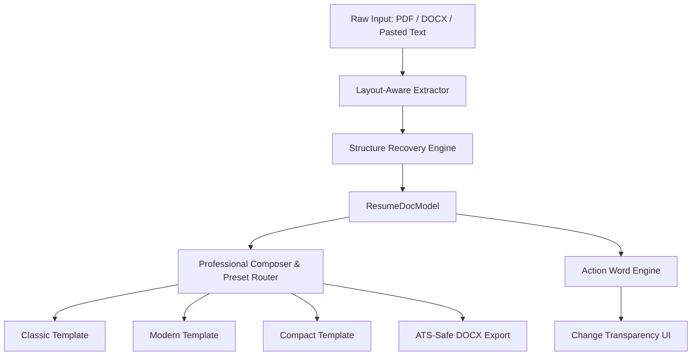

# Resume Layout Engine Architecture & Guide

## 1. Executive Summary

The **Resume Layout Engine** in HireFlow solves the long-standing industry challenge of parsed resume corruption:
- Eliminates run-on lines and unstructured blob text from multi-column PDFs and flat clipboard pastes.
- Reconstructs fragmented lines into semantic sections (Contact, Education, Experience, Projects, Categorized Skills, Languages, Links).
- Preserves 100% of candidate truth while enforcing a clean, professional typography and layout.
- Provides transparent before/after word diffs and light-touch action verb sequence tailoring (enforcing a strict ≤ 35% word budget).

---

## 2. Core Architecture Pipeline



### 2.1 Stage 2: Layout-Aware Text Extraction (`src/lib/tailorEngine/layoutExtractor.ts`)
- **PDF Extraction**: Groups raw `pdf.js` text items by y-coordinate (with a dynamic 0.45 * font-size tolerance), sorts tokens left-to-right by x-coordinate, detects 2-column layouts, and preserves indentation and bullet glyphs.
- **DOCX Extraction**: Detects document style cues (`Heading 1`, `Heading 2`, `ListParagraph`) and tab-separated date alignments.
- **Honest Detection Chip**: If extracted text contains < 2 detected sections, an amber badge warns the user that layout recovery is running, preventing false green checkmarks.

### 2.2 Stage 3: Structure Recovery Engine (`src/lib/tailorEngine/structure/`)
- **Heading Dictionary (`headingDict.ts`)**: Recognizes 50+ aliases across English and Indian campus formats (e.g., `Academics`, `Technical Skills`, `Key Projects`, `Work History`).
- **Inline Segmenter (`inlineSegmenter.ts`)**: Detects embedded section boundaries within flat run-on text with boundary confidence scoring.
- **Specialized Parsers**:
  - `headerParser.ts`: Name, headline, international/Indian phone regex (`+91`, `9000000000`), email, GitHub/LinkedIn URLs, and city.
  - `educationParser.ts`: Institution, degree, branch, dates, reverse chronological order, and `(Expected)` tag for ongoing degrees.
  - `skillsParser.ts`: Categorized skill rows (Programming, Web, Tools, Hardware/IoT, Databases) and hidden skills discovery from project bodies.
  - `projectsParser.ts`: Name, tech stack, and discrete action bullets.
  - `languagesLinksParser.ts`: Clean portfolio links with offloading of social media links to leftOut.
- **Guaranteed Invariants**:
  - **I1 (Conservation)**: No non-stopword tokens from original parsed resume sections are dropped silently without being accounted for (or classified as leftOut).
  - **I2 (No Invention)**: Recovered sections only contain text from the input (no fabricated degrees, employers, or skills).
  - **I3 (Determinism)**: Calling `recoverResumeStructure` on identical text produces byte-identical outputs.

### 2.3 Stage 4: Professional Composer & Templates (`src/lib/tailorEngine/docModel.ts`)
- **Single Source of Truth**: All templates and export generators consume `ResumeDocModel`.
- **Layout Presets**:
  - **Fresher**: Education prioritized before Experience.
  - **Skills-First**: Categorized skills immediately follow Header/Summary.
  - **Professional**: Work experience placed ahead of Education.
- **Templates**: `ClassicTemplate`, `ModernTemplate`, `CompactTemplate` enforce:
  - Clean typographic scale with standard margins.
  - Max 60 words per bullet block.
  - Zero literal bullet characters (`- `, `* `, `• `) in DOM.
  - Categorized skills grid/table for fast recruiter scanning.
- **Strengthen Checklist (`StrengthenChecklist.tsx`)**: Prompts candidate with missing contact audit, metrics ratio, and 1-click addition of hidden detected skills.

### 2.4 Stage 5: Action Word Engine & S1–S5 Tailoring (`src/lib/tailorEngine/actionWordEngine.ts`)
- **4-Slot Formula**: Evaluates bullets for `Action` (past-tense strong verb), `Object` (system/feature), `Tool` (technology/framework), and `Result` (quantifiable metric).
- **Action Verbs Taxonomy**: 61 strong verbs across 7 categories (Leadership, Technical Development, Optimization, Architecture, Execution, Collaboration, Problem Solving).
- **Light-Touch Word Budget**: Any bullet enhancement enforces LCS (Longest Common Subsequence) word diff budget of ≤ 35% words changed.
- **Seniority Advisory**: Warns candidates when target JD title is Senior/Lead while the candidate resume is fresher/entry level.

### 2.5 Stage 6: Change Transparency UI
- **Split Changes**: Differentiates automatic structural repairs (`Layout Repairs`) from suggested bullet optimizations (`Content Edits`).
- **Word Diff Highlighting**: Visual diff badges displaying additions (`+`), removals (`-`), and exact word change counts (`X / Y words`).
- **Layout Repairs Panel (`LayoutRepairsPanel.tsx`)**: Explains reverse-chronological reordering, ongoing graduation dates, and low-confidence boundaries with 1-click controls.
- **Accessibility**: All tab bar items and review buttons comply with WCAG 2.1 AA contrast ratio (≥ 4.5:1).

---

## 3. Verification & Test Coverage

The layout engine is covered by an exhaustive automated Vitest suite:
- `src/__tests__/tailor/stage2-extraction.test.ts`
- `src/__tests__/tailor/stage2-layout-parser.test.ts`
- `src/__tests__/tailor/stage3-structure-recovery.test.ts` (16 tests across 5 fixtures)
- `src/__tests__/tailor/stage3-engine-review.test.ts`
- `src/__tests__/tailor/stage4-composer-renderer.test.ts`
- `src/__tests__/tailor/stage4-export.test.ts`
- `src/__tests__/tailor/stage5-action-word-engine.test.ts`
- `src/__tests__/tailor/stage6-change-transparency.test.ts`
- `src/__tests__/tailor/stage7-comprehensive.test.ts`
- `src/__tests__/tailor/header-overlap.test.ts`

**Total Tailor Tests**: 65/65 passing.
**Production Build**: Clean `tsc && vite build` bundle created with zero errors.

---

## 4. Rollback Plan

If you ever need to restore the repository to the baseline state before the layout engine implementation, use:

```bash
git reset --hard pre-layout-engine
```
